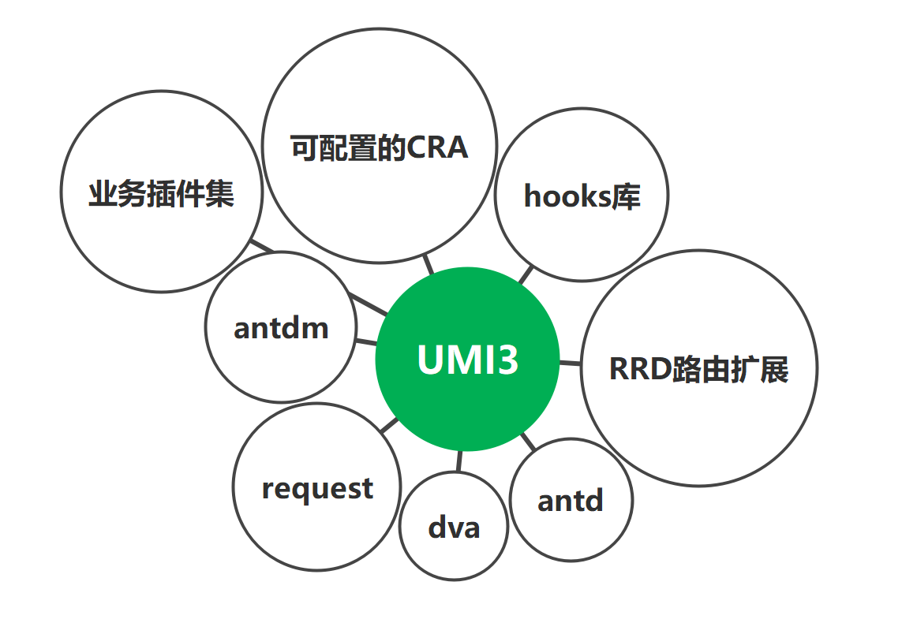

# 企业级前端框架UMI3  

[官网](https://umijs.org/zh-CN)

## 开篇词

### 开篇词 | react官方架构单薄，同事们都在用UMI

 Umi 是蚂蚁金服的底层前端框架，  是可扩展的企业级前端应用框架， 内置了路由、构建、部署、测试， 包含组件打包、文档工具、请求库、hooks 库、数据流等 ， 通过框架的方式简化 React 开发 

**知识结构图**



 UMI把大家常用的技术栈进行整理，收敛到一起，让大家只用 Umi 就可以完成 80% 的日常工作 

## 模块一 : 框架环境和基本使用

### 01 | 环境准备，快速上手

#### 准备工作

由于国内网络和前端的特殊性，在安装依赖等方面可能会失败或导致无法启动，浪费大量的时间，推荐使用yarn作为包管理器，并且使用国内镜像，推荐yrm这个工具管理yarn镜像

安装

```powershell
npm install -g yrm  
```

查看yarn镜像源

```powershell
yrm ls
```

切换源

```powershell
yrm use taobao
```

#### 项目初始化

 先找个地方建个空目录。 

```bash
mkdir myapp && cd myapp
```

使用yarn安装下载umi环境

```bash
yarn create @umijs/umi-app
```

安装依赖：

```shell
$ cd 目录
$ yarn
```

启动项目：

```jsx
yarn start
```

在浏览器里打开 http://localhost:8000/，能看到以下界面，


### 02 | 目录结构

 umi 更倾向于选择约定的方式，支持``js|jsx|ts|tsx``等后缀

```bash
.
├── dist                          // 默认的 build 输出目录
├── mock                          // mock 文件所在目录，基于 express
├── config
    ├── config.js                  // umi 配置，同 .umirc.js，二选一
├── public  					 						 // 变通的数据资源目录和一些无需打包的资源
└── src                           // 源码目录
    ├── layouts/index.js           // 全局布局
    ├── models					           // 数据流
    ├── wrappers					         // 权限管理
    ├── pages                     // 页面目录，里面的文件即路由
        ├── .umi                  // dev 临时目录，需添加到 .gitignore
        ├── .umi-production       // build 临时目录，会自动删除
        ├── document.ejs           // HTML 模板
        ├── 404.js                 // 404 页面
        ├── page1.js               // 页面 1，任意命名，导出 react 组件
        ├── page1.test.js          // 测试用例文件
        └── page2               		// 页面 2，内部可含有
    ├── global.css                 // 约定的全局样式文件，自动引入，也可以用 global.less
    ├── global.js                  // 可以在这里加入 polyfill
    ├── app.js                     // 运行时配置文件
├── .umirc.js                      // umi 配置，同 config/config.js，二选一
├── .env                           // 环境变量
└── package.json
```


### 03 | 构建时配置

 构建时是对开发环境配置，如果项目的配置不复杂，推荐在 `.umirc.ts` 中写配置； 如果项目的配置比较复杂，可以将配置写在 `config/config.ts` 中，并把配置的一部分拆分出去，现实往往是复杂的所以推荐``config/config`` , 两种配置方式二选一，`.umirc.ts` 优先级更高，采用config配置时，一般删除``.umirc.ts``

```jsx
import { defineConfig } from 'umi';
import proxy from './proxy';
import routes from './routes';
import theme from './theme'

export default defineConfig({
  nodeModulesTransform: {// node_modules 目录下依赖文件的编译方式
    type: 'none',// all 慢 兼容性好 none 快 兼容性一般
  },
  mfsu: {},//打包提速
  fastRefresh: {},//快速刷新 可以保持组件状态，同时编辑提供即时反馈
  title:'UMI3',//配置标题。
  mountElementId: 'app',//指定 react app 渲染到的 HTML 元素 id。
  favicon: '/favicon.ico',//使用本地的图片，图片请放到 public 目录

  routes: routes,

  proxy:proxy,//配置反向代理

  //启用按需加载
  dynamicImport: {
    loading: '@/components/loading',//按需加载时指定的loading组件
  },

  theme,//配置主题，实际上是配 less 变量。
  devServer: {
    port: 8666, // .env里面权限更高一些
    // https:true,//启用https安全访问，于对应协议服务器通讯
  }

})
```


### 04 |  模板约定  

umi内部默认没有html，会自行生成，如果需要修改， 新建 `src/pages/document.ejs` 

```html
<!doctype html>
<html>
<head>
  <meta charset="utf-8" />
  <meta name="viewport" content="width=device-width">
  <title>Your App</title>
</head>
<body>
  <div id="app"></div>
</body>
</html>
```


### 05 | antd, antd-mobile使用

**antd**

umi 已整合 antd 组件库，可通过``import {Xxx} from 'antd'``使用

使用指定版本组件库，``yarn add xx-xx@x.x.x``后，会优先使用指定版本

**antd主题设定**

找到``config/theme``

```jsx
export default {
  "@primary-color": "#399" // antd全局样式copy过来统一修改
};
```

[antd样式变量](https://ant.design/docs/react/customize-theme-cn)

**antd-mobile**

umi 已整合 antd-mobile 组件库，可通过``import {Xxx} from 'antd-mobile'``使用v5版本，可通过``import {Xxx} from 'antd-mobile-v2'``使用v2版本，使用指定版本组件库，``yarn add xx-xx@x.x.x``后，会优先使用指定版本，推荐使用v5

使用v5版本报错，找不到被使用的组件时尝试：

- 删除.umi
- 更新 @umijs/preset-react 包。npm view @umijs/preset-react versions; yarn add @umijs/preset-react -S
- 关闭mfsu
- 重启

v5主题修改

``src/global.less``

```less
:root:root {
  --adm-color-primary: #399;// antd-mobile全局样式copy过来统一修改
}
```

[antd-mobile提供的所有全局变量](https://mobile.ant.design/zh/guide/theming)

### 06 | 图片和其他资源引入 

项目中使用图片有两种方式，

1. 先把图片传到 cdn，然后在 JS 和 CSS 中使用图片的绝对路径
2. 把图片放在项目里，然后在 JS 和 CSS 中通过相对路径的方式使用

 前者趋向数据图片，后者趋向写死的图片，通过相对路径引入图片的时候，如果图片小于 10K，会被编译为 Base64嵌入网页

```jsx
import styles from './index.css';
import user from '../../assets/images/userBj.png'
function CssImg(props){
  return (
    <div>

      
      

      {/*动态图片 丢到服务器 推荐,或临时指向public 不推荐*/}
			
      
      
      <div className={styles.test1} style={{height:50}}>测试</div>
    </div>
  );
}

export default CssImg
```

```less
.test1{
  /* background: url("../../assets/images/bg.jpg"); */
  /* background: url("~@/assets/images/bg.jpg"); */
  background: url("/img/bg.jpg");
}
```


## 模块二 : 组件书写风格与页面跳转

### 01 | Less 变量，混合，嵌套，父选择器  

框架 自带了 less，css 及模块化的解析工具 ，推荐模块化使用less``import styles from 'xx.less``避免了全局污染 和 选择器复杂

模块化的基本原理很简单，就是对每个类名（非 :global 声明的）按照一定规则进行转换，保证它的唯一性。如果在浏览器里查看这个示例的 dom 结构，你会发现实际渲染出来是这样的：

```html
<div class="title___3TqAx">title</div>
```

类名被自动添加了一个 hash 值，这保证了它的唯一性。

>  实际开发中简单的样式我们并不推荐写 css，推荐使用模板组件来进行开发，或者直接写行内 css。css 并没有很好的依赖关系，很多项目都有冗余的 css，但是却不敢删除 

#### 全局变量

```jsx
{/* title 为global.less配置的整体样式 */}
<h2 className="title">全局样式</h2>


@import '~antd/es/style/themes/default.less';
//使用default的变量
.myLink {
  color: @primary-color;
  font-size: @font-size-base;
}
<div className={styles.myLink}>测试</div>
```

#### 局部变量

```less
@width: 100px;
@height: @width - 80px;

.header {
  width: @width;
  height: @height;
  background: red;
}
```

#### 混合

```less
.bordered (@topW: 1px, @bottomW: 2px) {
  border-top: dotted @topW black;
  border-bottom: solid @bottomW black;
}

#a1 {
  color: #111;
  .bordered();
}

.a2 {
  color: red;
  .bordered(2px, 4px);
  // border-bottom: solid 5px black; //覆盖混合
}
```

#### 嵌套

```less
.nesting {
  color: blue;
  h3 {
    color: coral;
  }
  p {
    color: aqua;
  }
}

<div className={styles.nesting}>
  <h3>测试</h3>
  <p>测试</p>
</div>
```

#### :global

打包后每个class名都会被自动加上一串唯一的序列号,在编译后模块化样式都会加上序号，global可使后面的样式编译后没有序号,脱离模块化，作用到全局，调用方式为非模块化

```less
/* 定义多个全局样式 */
.bars_right {
  font-weight: bold;
  :global {
    .ant-btn {
      border: 0;
    }
    .title {
      background: #fafafa;
    }
  }
}

<div className={styles.bars_right}>
	<button className={`ant-btn`}>按钮</button>
```


### 02 | hooks + 函数式编写组件  

#### 函数式编写组件

```jsx
function 组件(){}
const 组件 = (props) = >{
  
  //使用hooks
  
  //定义 函数 变量
  
  return jsx
}
```

#### hooks

##### **useContext**

组件上下文共享，越级传递数据，响应式

```jsx
// 创建上下文 context.jsx 
import {createContext} from 'react'
const AppContext = createContext({})
export default AppContext;


//祖先组件提供上文 parent.jsx
function 父组件() {
  const [msg, setMsg] = useState('hooks组件数据')
  return (
  	<AppContext.Provider value={{ msg, setMsg }}>
      ....
      <子组件/>
      ...
    </AppContext.Provider>
  )
}
//后代组件接受下文 child.jsx
import { useContext } from "react";
import AppContext from "../context";

function 后代组件(){
  const {msg,setMsg} = useContext(AppContext);
  return (
    <>
      <div>{msg}</div>
      <button onClick={()=>setMsg(msg+'xxxxx')}>按钮</button>
    </>
  )
}
```

##### **useMemo**

hooks出来之后，我们能够使用function的形式来创建包含内部state的组件。但是，使用function的形式，失去shouldComponentUpdate，我们无法通过判断前后状态来决定是否更新。在函数组件中，react不再区分mount和update两个状态，函数组件的每一次调用都会执行其内部的所有逻辑，如下：

```jsx
export default function Xxx() {
  
  const [count, setCount] = useState(1);
  const [value, setValue] = useState('');
  
  function getNum() {
    console.log("getNum");
    return count * 100
  }
 	
  return (
    {/* 组件任何一条数据变化，getNum函数重复调用 */}
    <div>getNum：{getNum()}</div>
    <button onClick={() => setCount(count + 1)}>+1</button>
    <input value={value} onChange={ev => setValue(ev.target.value)} />
  )
}
```

那么会带来较大的性能损耗。useMemo可指定依赖的数据变化才渲染，类似vue计算属性，返回缓存后的值数据，可拿去渲染

```jsx
const getNumMemo = useMemo(() => {
  //可执行一些没有副作用的业务，比如同步重新计算count
  return count * 100
}, [count])

return (
    {/* 组件任何一条数据变化，getNum函数重复调用 */}
    <div>getNum：{getNumMemo}</div>
    <button onClick={() => setCount(count + 1)}>+1</button>
    <input value={value} onChange={ev => setValue(ev.target.value)} />
  )
```

[^count]: 被依赖的数据，若无则多次执行，若为[]执行一次，一般需要依赖数据

##### **memo**

react父组件更新未传递给子的数据，子组件也会更新，如下：

```jsx
//修改count 或者 value 时，child组件都会更新
<button onClick={() => setCount(count + 1)}>+1</button>
<input value={value} onChange={ev => setValue(ev.target.value)} />
<Child count={count} />
```

memo可以协助子组件只依赖传递过来的数据变化时才更新

```jsx
import {memo} from 'react'

function Child({count}){
  const show = () => console.log('child组件渲染')
  return (
    <>
      <h3>Child2组件</h3>
      <div>{show()}</div>
      <div>{count}</div>
    </>
  )
}
//memo 修饰当前组件 依赖父的数据变化时，才渲染
export default memo(Child)

//不包装的情况下，父任意数据更新子都会更新
// export default Child
```

##### **useCallback**

由于组件内的业务函数传递给子组件时，每次都会是新的引用，会导致子组件无故更新，如下：

父组件

```jsx
//修改count 或者 value 时，child组件都会更新
<button onClick={() => setCount(count + 1)}>+1</button>
<input value={value} onChange={ev => setValue(ev.target.value)} />
<Child updateCount=(()=>console.log('业务')) />
```

子组件

```jsx
import {memo} from 'react'
function Child({updateCount}){
  const show = () => console.log('child组件渲染')
  return (
    <>
      <h3>Child3组件</h3>
      <div>{show()}</div>
      <button onClick={updateCount}>测</button>
    </>
  )
}
//memo 修饰当前组件 依赖父的数据变化时，才渲染 但依赖父的是个函数时memo无效
export default memo(Child)
```

useCallback可以将函数缓存起来，节省性能，指定某个被依赖的数据变化才更新函数，子组件配合memo实现，如下：

```jsx
export default () => {
  
  const updateCount = useCallback(()=>{
    //业务
  },[])

  return (
  	 //修改count 或者 value 时，child组件都会更新
    <button onClick={() => setCount(count + 1)}>+1</button>
    <input value={value} onChange={ev => setValue(ev.target.value)} />
    <Child updateCount={updateCount} />
  )
}
```

[^count]: 被依赖的数据，若无则多次执行，若为[]执行一次，一般需要依赖数据

##### useLayoutEffect

useLayoutEffect**早于**类组件**早于**useEffect

**挂载时**

类render → 函数render → useLayoutEffect→ 类didmount → useEffect

**更新时**

类render渲染 → 函数render → useLayoutEffect 销毁→ useLayoutEffect 执行→ 类didUpdate → useEffect 销毁… → useEffect 执行

### 03 | 路由,权限,动态,约定式  

页面地址的跳转都是在浏览器端完成的，不会重新请求服务端获取 html，html 只在应用初始化时加载一次  ，页面由不同的组件构成，页面的切换其实就是不同组件的切换， 只需要在把不同的路由路径和对应的组件关联上 ，实现方式如下两种

- 配置型路由（`在配置文件写入相关配置代码`)，配置型存在时，约定式失效

- 约定式(`约定文件位置名称与格式无需写代码配置`)

约定式是理想型方案，实际开发一般会向现实低头，推荐采用配置型路由

配置`config/config`的`routes`属性，接受数组，一般单独写一个routes模块文件如下:

```jsx
//  config/routes
export default [
  { path: '/less', component: 'less' },// 不写路径从 src/pages找组件
  { path: '/antd', component: './antd' },//当前指向pages
  { component: '@/pages/404' },//@指向src
]
```

[^path]: 浏览器地址栏地址
[^component]: 要打开的组件

```jsx
//  config/routes
export default [
  ...
  { path: '/antd', component: 'antd' },
  {  path:'/', redirect: '/antd' },
  { component: '@/pages/404' },//@指向src
]
```

[^redirect]: 重定向

```jsx
export default [
    { path: '/login', component: 'login' },
    { path: '/reg', component: './reg' },

    {
      path: '/',
      component: '@/layouts/layout1',// layout组件
      routes: [
        { path: '/less', component: 'less' },
        { path: '/antd', component: 'antd' },
        {  path:'/', redirect: '/antd' },
        { component: '@/pages/404' },
      ],
    },

    { component: '@/pages/404' },


  ]
```

[^layout组件]: 布局组件，控制一部分路由在跳转前先渲染布局组件自身UI，执行自身业务，后在自身内部渲染目标路由组件
[^routes]: 配置子路由，通常在需要为多个路径增加 layout 组件时使用

```jsx
//layouts/布局组件

//可引入一些components下的公共组件来完成公共布局
import Nav1 from '../../components/nav1'
import styles from './index.less'

const Layout1 = props => {
  return (
    <>
      {props.children}
      <div className={styles['adm-tab-bar']}><Nav1/></div>
    </>
  )
}

export default Layout1;
```

[^props.children]: 布局组件内部渲染的目标路由组件

```jsx
{ path: '/user', component: 'user',wrappers:['@/wrappers/auth']},//路由守卫
```

[^wrappers]: 当前工权限校验工作可交给一个或者多个组件介权，通过了才被允许到目标路由

```jsx
//wrappers/auth
import { Redirect } from 'umi'

export default (props) => {
  if (Math.random() < .5) {
    return <div>{props.children}</div>;
  } else {
    return <Redirect to="/login" />;
  }
}
```

多级子路由

```jsx
{ 
  path: '/goods', 
  component: '@/layouts/layout2',//展示区
  routes:[
    // { path: '/goods', component: 'goods' },
    // { path:'/goods', redirect: '/goods/2' },//这里的
    { path: '/goods/:id?', component: 'goods/goods-detail' },//动态可选路由
    { path: '/goods/:id/comment', component: 'goods/comment' },//不配routes,占用当前展示区
    { path: '/goods/:id/comment/:cid', component: 'goods/comment/comment-detail' },
    { component: '@/pages/404' },
  ]
},
```

[^:变量]: 动态路由，路由名为动态可变
[^:变量?]: 动态可选路由，路由名可变，且可不传递


### 04 | 页面跳转，参数接收

声明式跳转+传参

```jsx
const nav1 = ()=>{
  return (
  	<NavLink activeClassName={styles.xx} to="/antd">antd</NavLink>
  	<NavLink activeStyle={{color:'#399'}} to="/antd">antd</NavLink>
  	<Link to="/antd">antd</Link>
  	<Link to={{pathname:'/antd',search:'?a=1',query:{a:1}}}>antd</Link>
  )
}
```

编程式跳转+传参

```jsx
//history可以导入或者上下文获取
import { history } from 'umi';
const 组件({history})=>{}

// 跳转到指定路由
history.push('/list');

// 带参数跳转到指定路由
history.push('/list?a=b');
history.push({
  pathname: '/list',
  query: {
    a: 'b',
  },
});

// 跳转到上一个路由
history.go(-1);
```

参数接收

```jsx
//可以从组件上下文获取
const 组件 = ({location,match})=>{}

//如果没有上下文可以withRouter包装组件
import { withRouter } from 'umi';
const withRouter({location,match})=>{}

//可以直接使用umi的hooks获取
import { useLocation,useParams,useRouteMatch} from 'umi';
const 组件 = ()=>{
  const params = useParams();
  params.id | params.cid
  const location = useLocation();
  location.search | location.query
}
```

相关api[查阅](https://umijs.org/zh-CN/api#link)

## 模块三 : 数据生成与请求

### 01 |  数据模拟umi-mock    

 Mock 数据是前端开发过程中必不可少的一环，是分离前后端开发的关键链路。通过预先跟服务器端约定好的接口，模拟请求数据甚至逻辑，能够让前端开发独立自主，不会被服务端的开发所阻塞 

UMI3里约定 mock 文件夹下的文件或者 page(s) 文件夹下的 _mock 文件即 mock 文件，文件导出接口定义，支持基于 `require` 动态分析的实时刷新，支持 ES6 语法，以及友好的出错提示。

```js
export default {
  // 支持值为 Object 和 Array
  'GET /api/users': { users: [1, 2] },
  
  // GET 可省略
  '/api/users/1': { id: 1 },

  // 支持自定义函数，API 参考 express@4,可完成业务
  'POST /api/users/create': (req, res) => {res.end('OK'); },
};
```

当客户端（浏览器）发送请求，如：`GET /api/users`，那么本地启动的 `umi dev` 会跟此配置文件匹配请求路径以及方法，如果匹配到了，就会将请求通过配置处理，就可以像样例一样，你可以直接返回数据

[Mock.js](http://mockjs.com/) 辅助生成自然且多条数据

```js
import Mock from 'mockjs';

export default {
  // 使用 mockjs 等三方库
  'GET /api/tags': Mock.mock({
    'list|100': [{ name: '@city', 'value|1-100': 50, 'type|0-2': 1 }],
  }),
};
```

对于整个系统来说，请求接口是复杂并且繁多的，为了处理大量模拟请求的场景，我们通常把每一个数据模型抽象成一个文件，统一放在 `mock` 的文件夹中，然后他们会自动被引入。

为了更加真实的模拟网络数据请求，往往需要模拟网络延迟时间，可以通过第三方插件来简化这个问题，如：[roadhog-api-doc#delay](https://github.com/nikogu/roadhog-api-doc/blob/master/lib/utils.js#L5)。

```js
import { delay } from 'roadhog-api-doc'; // 模拟延时

export default delay(
  {
    // 支持值为 Object 和 Array
    '/umi/goods': [
      { id: 1, name: '韭菜' },
      { id: 2, name: '西红柿' },
    ],
  },
  2000,
); //延时
```

介权

```jsx
//mock/auth
export default {
  'POST /umi/login': (req, res) => {
    const { username, password } = req.body;
    if (username === 'alex' && password === 'alex123') {
      res.send({
        err: 0,
        msg: '成功',
        currentAuthority: 'user',
      });
    } else if (username === 'admin' && password === 'admin123') {
      res.send({
        err: 0,
        msg: '成功',
        currentAuthority: 'admin',
      });
    } else {
      res.send({
        err: 1,
        msg: '失败',
      });
    }
  },
};

```

分页

```jsx
//查分页
//指定页数范围内显示全数据，超过只显示两条
'GET /umi/list': (req, res) => {
  const { _page = 1, _limit = 3 } = req.query;

  const totalPage = 3; //设定总页数
  const lastPageLimit = 2; //设定尾页条数
  const total = _limit * (totalPage - 1) + lastPageLimit; //计算总条数

  res.send({
    code: 0,
    data: {
      _page,
      _limit,
      total,
      //控制data键，后面数组的条数
      ...Mock.mock({
        [`data|${_page >= totalPage ? lastPageLimit : _limit}`]: [
          {
            'id|+1': 1,
            create_at: '@date("yyyy-MM-dd HH:mm:ss")',
            'type_str|1': [
              '中转费明细',
              '调整单明细',
              '代收到付明细',
              '客户运费明细',
              '导入失败记录',
            ],
            name: function () {
              return [
                Mock.mock('@datetime("MMdd")'),
                Mock.mock('@county()'),
                this.operator,
              ].join('-');
            },
            path: 'http://xxx/shop/quotation/导入失败列表.xlsx',
            operator: '@cname',
            'status|1': ['0', '1', '2', '3'],
          },
        ],
      }),
    },
  });
},
```

增删改

```jsx
//增
'POST /umi/list': (req, res) => {
  console.log(req.body);
  res.send(
    Mock.mock({
      'data|1': [
        {
          code: 0,
          data: { ...req.body, a: 2 },
          msg: '成功',
        },
        {
          code: 1,
          msg: '失败',
        },
      ],
    }).data,
  );
},

//删
'DELETE /umi/list/:id': (req, res) => {
  console.log(req.params.id);
  res.send(
    Mock.mock({
      'data|1': [
        {
          code: 0,
          data: { task_id: '123' },
          msg: '成功',
        },
        {
          code: 1,
          msg: '失败',
        },
      ],
    }).data,
  );
},
  
//改
'PATCH /umi/list/:id': (req, res) => {
  console.log(req.body);
  res.send(
    Mock.mock({
      'data|1': [
        {
          code: 0,
          data: { ...req.body },
          msg: '成功',
        },
        {
          code: 1,
          msg: '失败',
        },
      ],
    }).data,
  );
},
```

### 02 |  数据模拟 json-server   

一款第三方模拟服务器和数据的包，支持json文件存本地被修改，自动生成resut风格可操作的接口，有效的CURD操作，对数据要求高时，推荐使用

### 03 | 反向代理 

工作中前后端是分离式开发，需要访问本地或者线上真实服务器时，跨域也成了每个前端工程师都需要了解的基本知识，解决方案有前端或者后端开发人员来解决

在 UMI3 中配置`config/config`的proxy键，接受一个对象，可单独做一个模块到`config/proxy`，并暴露出来

```tsx
export default {
  '/api/': {
    // 要代理的真实服务器地址
    target: 'https://localhost:9001',
    // 配置了这个可以从 http 代理到 https
    https:true
    // 依赖 origin 的功能可能需要这个，比如 cookie
    changeOrigin: true,
    pathRewrite: { '^/api': '' },//路径替换
  } 
}
```


### 04 |  fetch请求    

fetch是原生的数据请求方法，返回promise

```tsx
const getData = async () => {
    //let res = await fetch('/umi/goods/home?_limit=3'); 
		let res = await fetch(
    '/umi/login',{
      method:'post',
      headers:{"Content-type":"application/x-www-form-urlencoded"},
      body:'username=alex&password=alex123'
    });
    let data = await res.json();
    console.log(data);
};
```


### 05 |  umi-request请求 

 通过 `import { request } from 'umi';` 你可以使用内置的请求方法。第一个参数是 url，第二个参数是请求的 options。options 具体格式参考 [umi-request](https://github.com/umijs/umi-request/blob/master/README_zh-CN.md)，也和axios用法基本一致

```jsx
const getData = async () => {
  let res = await request('/umi/goods',{params:{_limit:1}})
  // let res = await request('/api/goods/home',{params:{_limit:1}})
  console.log(res)
}
```

### 06 |  useRequest请求

useRequest 是最佳实践中内置的一个 Hook ，默认对数据要求必须返回一个data字段，如果不希望有此限定，可以构建时配置一下`config/config`

```jsx
request: {
  dataField: '',
},
```

在组件初次加载时， 自动触发该函数执行。同时 useRequest 会自动管理异步请求的 `loading` , `data` , `error` 等状态。

```tsx
import {useRequest} from 'umi'

export default function  RequestHooks(){

  // 用法 1
  const { data, error, loading } = useRequest('/umi/goods');

	// 用法 2
  const { data, error, loading } = useRequest({
    url: '/umi/goods',
    params:{_limit:1}
  });

	// 用法 4
  const { data, loading, run } = useRequest((_limit) => ({
    url: '/umi/goods',
    params: { _limit }
  }), {
    manual: true,//手动通过运行run触发
  });
  
  // 轮询
  const { data, loading, run } = useRequest((_limit) => ({
    url: '/umi/goods',
    params: { _limit }
  }), {
    manual: true,//手动通过运行run触发
    pollingInterval:1000,//轮询 一秒读一次
    pollingWhenHidden:false,//屏幕不可见时，暂停轮询
  });
  
  if (error) {
    return <div>failed to load</div>
  }

  if (loading) {
    return <div>loading...</div>
  }

  return (
    <div>{JSON.stringify(data)}</div>
    <button onClick={()=>run(1)}>手动</button>
  );
}
```

###### 

## 模块四 ：状态管理

### 01｜dva 介绍    

 dva 首先是一个基于 [redux](https://github.com/reduxjs/redux) 和 [redux-saga](https://github.com/redux-saga/redux-saga) 的数据流方案，被umi以插件的方式内置，无需安装直接使用，在原有redux使用基础上更加简化和高效

dva里面有关状态管理（数据流）的角色和redux的对比如下

|                      | redux    | dva          |
| -------------------- | -------- | ------------ |
| 状态数据             | state    | state        |
| 行为描述             | action   | action       |
| 无副作用业务         | reducer  | reducer      |
| 有副作用业务         | creators | effect       |
| 通讯请求修改状态函数 | dispatch | dispatch     |
| 通讯请求获取状态函数 | connect  | connect      |
| 从 **源** 获取数据   | 无       | subscription |

[^状态数据]:  javascript 对象，存公共状态的仓库
[^行为描述]: javascript 对象，必须带有 `type` 属性指明具体的行为，其它字段可以自定义
[^dispatch]: 用于触发 action 的函数
[^无副作用业务]: 一个纯函数，处理公共状态时的一些同步业务
[^有副作用业务]: 处理公共状态时的一些异步业务
[^connect]: 连接状态仓库state，把数据流向组件页面


### 02 | 数据流向   

 数据的改变发生通常是通过用户交互行为或者浏览器行为（如路由跳转等）触发的，当此类行为会改变数据的时候可以通过 `dispatch` 发起一个 action，如果是同步行为会直接通过 `Reducers` 改变 `State` ，如果是异步行为（副作用）会先触发 `Effects` 然后流向 `Reducers` 最终改变 `State` ，最后`State`的数据再流回组件页面


定义一个dva的Model如下：

```jsx
export default {
  namespace:'Model名'，//省略不写，认定文件名为Model名
  state:{公共状态数据},
  reducers:{一堆纯函数},
  effects:{一堆异步副作用函数}
	subscription:{一堆监听函数}
}
```


### 03 | 全局数据&页面数据获取和修改 

全局数据定义在`src/models/XX`，所有页面都可以访问，同步业务的处理交给reducers

```JSX
import { history, request } from 'umi';
import key from 'keymaster';

export default {
  
  namespace: 'global',//所有models里面的namespace不能重名
  
  //初始化全局数据
  state: {
    title:'全局 title',
    text: '全局text',
    login: false,
    a:'全局models aaaa',
  },
  
  //处理同步业务  接收dispatch({type:'global/setText',...
  reducers: {
    setText(state) {
      // copy更新并返回
      return {
        ...state,
        text: '全局设置 后的text'+Math.random().toFixed(2),
      };
    },
    setTitle(state,action) {//action 接受到的参数
      return {
        ...state,
        title: `全局设置 后的title${action.payload.a}/${action.payload.b}`,
      };
    },
    signin:(state)=>({
      ...state,
      login: true,
    }),
  },
  
};

```

组件内部获取和修改全局数据

```jsx
import {connect} from 'umi'

const 组件 = (props) => {
  return (
    <>
      <h3 className="title">获取全局 state  </h3>

      <div>text:{props.text}</div>
      <div>title:{props.title}</div>
      <div>a:{props.A}</div>
      {
        props.isLogin ? <div>已登录</div> : <div>未登录</div>
      }

      <h3 className="title">修改全局 state</h3>
      <button
        onClick={() => {
          props.dispatch({
            type: 'global/setText',
          });
        }}
      >
        修改全局text,不传参
      </button>

      <button
        onClick={() => {
          props.dispatch({
            type: 'global/setTitle',
            payload:{a:1,b:2}
          });
        }}
      >
        修改全局text,传参
      </button>
    </>
  );
}

export default connect(state => ({
  //抓取全局,重命名
  text: state.global.text,
  title: state.global.title,
  A: state.global.a,
  isLogin: state.global.login,
}))(组件);
```

页面数据获取和修改

页面数据定义在`pages/页面目录/model.js`或者`pages/ 页面目录/models/*.js`，当前``页面目录``只分配一个数据文件时，使用`model.js`,当前`页面目录`分配多个数据文件时，使用`models/*.js`

``页面目录/*.jsx``可访问当前`页面目录/model.js`及当前`页面目录/models/*.js`,也可向上访问，但子集`页面目录`和同级`页面目录`数据不可访问

```jsx
//pages/*/model.js
export default {
  namespace: 'dva',
  state: 'bmw', 
  reducers: {
    setStr(state) {
      return 'qq';
    },
  }
};

//pages/*/models/a.js
export default {
  namespace: 'a',
  state: 'page model a',
};

```

组件内部获取和修改页面数据

```jsx
import {connect,getDvaApp} from 'umi'
import Child from './child'

const Dva = (props) => {
  return (
    <>
      <h3 className="title">获取页面models</h3>
      <p>model.js里面的数据:{props.dva}</p>
      <p>models目录里面的的数据:{props.a}</p>
      <p>models目录里面的的数据:{props.b}</p>
      <hr/>
      <h3 className='title'>修改页面model数据</h3>
      <button onClick={()=>props.dispatch({type:'dva/setStr'})}>修改</button>
    </>
  );
}

export default connect(state => ({
  //抓取页面级别
  dva:state.dva,
  a: state.a,
  b: state.b,
}))(Dva);

//connect不传参不获取数据，dispatch默认传给组件
//export default connect()(Dva);
```

### 04 | 异步逻辑处理      

effects处理异步等一些有副作用的逻辑，如下

```jsx
import { request } from 'umi';
export default {
  namespace: 'global',//所有models里面的namespace不能重名
  state: {
    login: false,
  },
  reducers: {//处理同步 左key 接收dispatch({type:key
    signin:(state,{type,payload})=>({
      ...state,
      login: true,//payload.实际数据决定login的值
    }),
  },
  effects: {
    //接收来自 dispatch({type:'global/login'...
    *login(action, { call, put, select }) {
      const data = yield call(request,'/umi/login',{method:'post',data:{username:action.payload.username,password:action.payload.password}})
      yield put({
        type: 'signin',
        payload:data
      });
    },
  }
};

```

[^call]: 执行异步函数
[^put]: 发出一个 Action，给reducers
[^select]: 从state里获取数据,如`const todos = yield select(state => state.todos)`
[^yield]: 状态机语法，类似await，同步书写异步代码
[^action]: 可获取发送请求时的类型，携带的负载

### 05 | 丢弃connect高阶组件，转投hooks

```jsx
import { useDispatch, useSelector } from 'umi';

const 组件 = () => {
  const dispatch = useDispatch();
  const { dva } = useSelector((state) => ({ dva: state.dva }));
  return (
    <>
      <h3 className="title">子组件3</h3>
      <div>{dva}</div>
      <div>
        <button
          onClick={() => {
            dispatch({ type: 'global/setTitle', payload: { a: 11, b: 22 } });
          }}
        >
          修改全局model
        </button>
      </div>
    </>
  );
};

export default 组件;

```


### 06 | subscriptions **源** 获取 

订阅一个数据“源”的变化，使用场景如：服务器的 websocket 连接、keyboard 输入、geolocation 变化、history 路由变化

```jsx
import key from 'keymaster';

export default {
  namespace: 'global',
  state: {
  },
  subscriptions: {
    listenRoute({ dispatch,history}) {
      history.listen(({ pathname, query }) => {
        console.log('global subscriptions',pathname,query);
      });
    },
    listenKeyboard({dispatch}) {//监听键盘
      key('⌘+i, ctrl+i', () => { dispatch({type:'setText'}) });
    },
    listenResize({dispatch}) {//监听窗口变化
      window.onresize = function(){
        console.log('onresize')
      }
    },
    listenScroll({dispatch,history}){
      window.onscroll=function () {
        console.log('onscroll')
      }
    }
  },
};

```

[^listenRoute]: subsription中的方法名是随意定的
[^dispatch]: 发送action给reducers
[^history]: 等同于umi包内history对象


## 模块五 ：运行时配置

构建时配置`config/config`能覆盖大量场景，但有一些却是编译时很难触及的。

比如：

- 在出错时显示个 message 提示用户
- 在加载和路由切换时显示个 loading
- 页面载入完成时请求后端，根据响应动态修改路由

 运行时配置和构建时配置的区别是他跑在浏览器端，基于此，我们可以在这里写函数、jsx、import 浏览器端依赖等等，注意不要引入 node 依赖。 

**配置方式**

约定 `src/app.jsx` 定义并暴露一些固定名称的函数，他们会在浏览器端择机运行，全局执行一些业务

### 01 | 渲染前的权限校验

render函数， 用于改写把整个应用 render 到 dom 树里， 覆写 render，接受一个 oldRender 函数，最后用 oldRender 来渲染dom， 需至少被调用一次 

```jsx
export const render = async (oldRender) => {
  const { isLogin} = await request('/umi/auth');
  if (!isLogin) {
    history.push('/login');
  }
  // oldRender， Function，原始 render 方法，需至少被调用一次
  oldRender();
}  

```

```jsx
//mock/auth  
'GET /umi/auth': (req, res) => {
  res.send({
    isLogin: true,
  });
},
```

[^注意]: render方法只调用一次

### 02 | 动态路由读取、添加

`patchRoutes`函数提供了在运行时，动态修改路由的入口，一般可以和`render`函数配合， 请求服务端根据响应动态更新路由 

```jsx
export function patchRoutes({ routes }) {
	//routes为当前路由
  routes.unshift({
    path: '/foo',
    exact: true,
    component: require('@/pages/foo').default,
  });
}
```

需要注意的地方是：

- 动态路由的`compnent`要的是一个组件不是一段地址，可通过require引入
- 动态路由读取后，跳转后不显示，需要关闭mfsu: {}
- 子路由不跳转，除了layout组件，其他需要添加exact，构建时的配置在编译后都会自动加，而动态路由如果路由数据没有exact会导致不跳转
- 数据数据里面不可以有require，数据需要过滤，require(非空字符拼接+变量)
- document.ejs报错，需要require拼接时找到index.jsx 目前umi3有这个问题


模拟路由数据

```jsx
//mock/auth

'GET /umi/menus': (req, res) => {
    res.send([
      {
        path: '/',
        component: 'layouts/layout1',
        routes: [
          {
            title: '资源引入',
            path: '/resources',
            component: 'pages/css-img',
          },
          { path: '/less', component: 'pages/less' },
          {
            path: '/goods',
            component: 'layouts/layout2',
            routes: [
              { path: '/goods/:id?', component: 'pages/goods/goods-detail' },
              {
                path: '/goods/:id/comment',
                component: 'pages/goods/comment',
              },
              {
                path: '/goods/:id/comment/:cid',
                component: 'pages/goods/comment/comment-detail',
              },
              { component: 'pages/404' },
            ],
          },
          { path: '/data-interaction', component: 'pages/data-interaction' },
          { path: '/dva', component: 'pages/dva' },
          { path: '/antd', component: 'pages/antd' },
          { path: '/hooks', component: 'pages/hooks' },
          {
            path: '/user',
            component: 'pages/user',
            wrappers: ['wrappers/auth'],
          },

          { path: '/', redirect: '/antd' },
          { component: 'pages/404' },
        ],
      },
      { component: 'pages/404' },
    ]);
  },
```

读取路由数据并添加路由：

```jsx
//src/app

let routesData = [];//模块变量用来存储路由数据

//render函数里面读取路由数据
export const render = async (oldRender) => {
  const { isLogin } = await http('/umi/auth');
  if (isLogin) {
    //获取路由数据
    routesData = await http('/umi/menus');
  } else {
    history.push('/login');
  }
  oldRender();
};

export function patchRoutes({ routes }) {
  filterRoutes(routesData);//处理数据，添加exact，指定index.js,拼接require
  routesData.map((item) => routes.push(item));//动态添加路由
}

const filterRoutes = (routesData) => {
  routesData.map((item) => {
    
    //exact处理
    if (item.routes && item.routes.length > 0) {
      filterRoutes(item.routes);//含 routes键的需要递归处理
    } else {
      item.exact = true;//不含routes键的都添加exact
    }
    
    //component地址拼接处理
    if (!item.redirect) {//不处理带有redirect字段
      if (item.component.includes('404')) {//404没有index文件结构
        item.component = require('@/' + item.component + '.jsx').default;
      } else {
        //其他页面都指向index结构，避免umi3的document.ejs报错
        item.component = require('@/' + item.component + '/index.jsx').default;
      }
     	//部分需要授权路由的拼接
      if (item.wrappers && item.wrappers.length > 0) {
        item.wrappers.map((str, index) => {
          item.wrappers[index] = require('@/' + str + '.jsx').default;
        });
      }
    }
  });
};
```


### 03 | 路由监听，埋点统计

 `onRouteChange`函数内部可以设置，在初始加载和路由切换时做一些事情，比如埋点，设置动态标题等操作

```jsx
export function onRouteChange({ matchedRoutes, location, routes, action }) {
  //动态设置标题
  document.title = matchedRoutes[matchedRoutes.length - 1].route.title || '默认标题'
}
```

[^matchedRoutes]: 当前匹配的路由及其子路由
[^location]: history 提供的 location 对象
[^routes]: 路由集合
[^action]: `PUSH|POP|REPLACE|undefined`，初次加载时为 `undefined`


### 04 | 拦截器 

umi内置的request和useRequest在发送请求之前和数据返回后，可以做一些通用的配置业务，这个时候考虑配置拦截器，参考[插件配置](https://umijs.org/zh-CN/plugins/plugin-request#%E8%BF%90%E8%A1%8C%E6%97%B6%E9%85%8D%E7%BD%AE)

```jsx
export const request = {
  requestInterceptors: [
    (url, options) => {
      // 请求地址 配置项
      options.headers = {
        token:'..',
      };
      return { url, options };
    },
  ],
  responseInterceptors: [],
};
```

[^注意]: 对fetch和第三方的请求库无效，如axios，需要自行配置


##  结束语  

###  结束语 | 未来愉快替代create-react-app 开发  

umi3框架到这里就告一段落了，一般适合开发一些h5端的各类web应用，如果考虑开发中台管理系统，推荐去看看蚂蚁系还提供了antd-pro框架，当然这一部分的视频录制也在进行中，敬请期待

